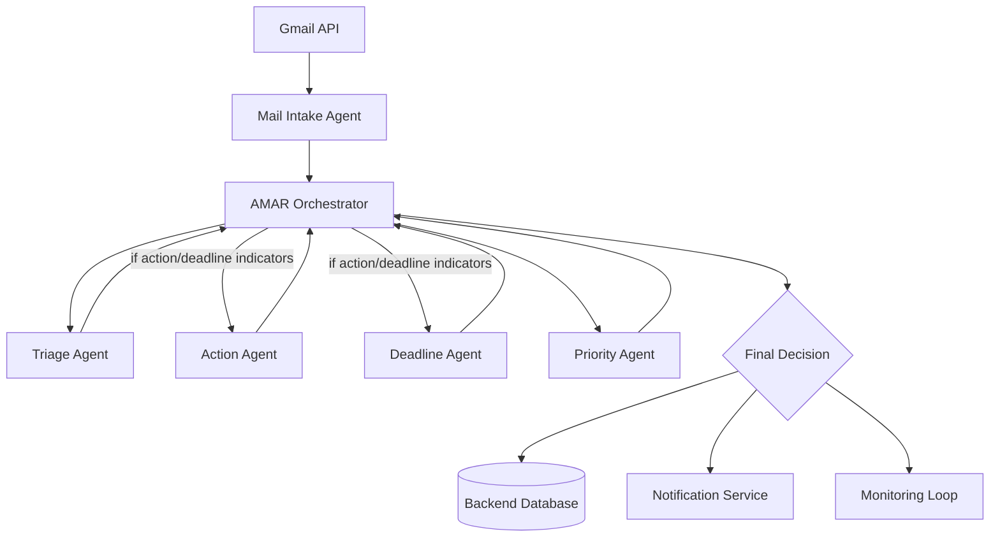
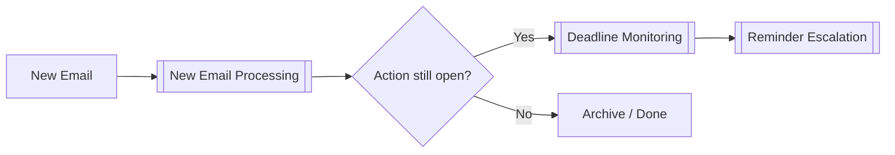

# 🧠 AGENT AMAR — Agent Control Center

> This is the main entry point of the AGENT AMAR vault.
> Obsidian is the **control center, knowledge layer, and documentation hub** — not the application database.

---

## 1. System Mission

**AGENT AMAR** is an autonomous, AI-powered mail intelligence system designed to **prevent the user from missing important emails**.

It continuously monitors incoming and unread email and decides:

- What **type** of email it is
- Whether the user must take an **action**
- Whether a **reply** is required
- Whether a **deadline** exists
- How **urgent** the email is
- Whether it should trigger a **notification**
- Whether it must be **monitored** until the user handles it

The system is biased toward protecting the user's academic and career opportunities (internships, placements, jobs, assignments, exams, faculty communication).

---

## 2. Architecture Overview

AGENT AMAR is a **multi-agent system** coordinated by a central orchestrator. Each agent is **specialised** and does one job well. The orchestrator **coordinates** — it does not do deep analysis itself.

### Design principles

- Keep every agent **specialised**.
- The orchestrator **coordinates instead of doing everything**.
- Prefer **deterministic code** for calculations and state tracking.
- Use **AI** for language understanding, classification, extraction, and ambiguous judgement.
- All agent outputs are **structured JSON** (see [[Agent Output Schema]]).
- Obsidian stores knowledge, rules, policies, prompts, and human-readable memory.
- A proper **database** stores operational application data.

---

## 3. Active Agents

| Agent | Role | Question it answers |
|---|---|---|
| [[AMAR Orchestrator]] | Central coordinator | "Who should handle this, and what is the final decision?" |
| [[Mail Intake Agent]] | Deterministic email parser | "What are the clean, structured facts of this email?" |
| [[Triage Agent]] | Classifier | "What kind of email is this?" |
| [[Action Agent]] | Action extractor | "What does the user need to do?" |
| [[Deadline Agent]] | Deadline extractor | "When does the user need to act?" |
| [[Priority Agent]] | Urgency scorer | "How important and urgent is this?" |

---

## 4. Core Workflows

- [[New Email Processing]] — end-to-end flow from email received to notify/monitor
- [[Deadline Monitoring]] — how the system tracks an important action until it is done
- [[Reminder Escalation]] — escalating alerts as a deadline approaches

---

## 5. Memory Layer

Human-readable knowledge that agents read from and that humans can edit directly.

- [[User Preferences]] — priority categories, notification rules, learned + explicit overrides
- [[Important Senders]] — structured list of senders that matter
- [[Classification Rules]] — how the [[Triage Agent]] decides categories
- [[Priority Rules]] — how the [[Priority Agent]] scores urgency

---

## 6. Schemas

All agents exchange structured JSON.

- [[Email Schema]] — normalised email produced by [[Mail Intake Agent]]
- [[Agent Output Schema]] — the common envelope every agent returns
- [[Action Schema]] — shape of an extracted action from [[Action Agent]]
- [[Persistent Email State]] — durable operational state (DB) after the pipeline (Phase 9)
- [[Reminder Schema]] — user-scheduled reminders + notification events (Phase 10)

---

## 7. Logs

- [[Agent Activity Log]] — human-readable trace of agent events for debugging

---

## 8. System Status

| Item | Status |
|---|---|
| Vault structure | ✅ Created |
| Agent definitions | ✅ Drafted |
| Workflow docs | ✅ Drafted |
| Memory layer | ✅ Drafted |
| Schemas | ✅ Drafted |
| Backend database | ✅ Phase 9 (SQLite / SQLAlchemy 2.x) |
| Gmail API integration | ✅ Phase 2 (OAuth 2.0, `gmail.readonly`) |
| Orchestrator runtime | ✅ Phase 8 (deterministic coordinator) |
| Deadline monitor + escalation | ✅ Phase 10 (on-demand; events only) |
| Notification **delivery** | ⬜ Phase 11 (background scheduler + Flutter) |

---

## 9. Current Development Stage

**Stage 0 — Design & Knowledge Base.**
The vault documents the intended system. No backend code exists yet.

Next: define the [[Email Schema]] concretely, then build the [[Mail Intake Agent]] against real Gmail API payloads.

---

## 10. Quick Navigation

- 📊 Dashboard: [[Agent Control Center]]
- 🤖 Agents: [[AMAR Orchestrator]] · [[Mail Intake Agent]] · [[Triage Agent]] · [[Action Agent]] · [[Deadline Agent]] · [[Priority Agent]]
- 🔀 Workflows: [[New Email Processing]] · [[Deadline Monitoring]] · [[Reminder Escalation]]
- 🧠 Memory: [[User Preferences]] · [[Important Senders]] · [[Classification Rules]] · [[Priority Rules]]
- 📦 Schemas: [[Email Schema]] · [[Agent Output Schema]] · [[Action Schema]] · [[Persistent Email State]] · [[Reminder Schema]]
- 📝 Logs: [[Agent Activity Log]]
