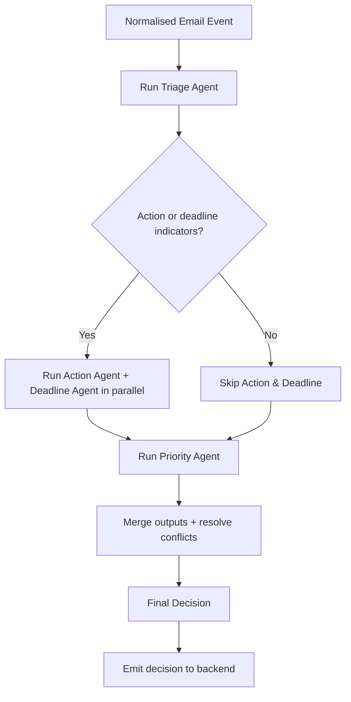

# 🤖 AMAR Orchestrator

**Type:** Coordinator agent
**Related:** [[Agent Control Center]] · [[New Email Processing]] · [[Agent Output Schema]]

---

## Role

The **central coordinator** of AGENT AMAR. It receives structured email events and decides which specialised agents run, in what order, then merges their outputs into one final decision.

> The orchestrator **coordinates**. It does **not** perform deep analysis when a specialised agent can do it.

---

## Responsibilities

- Receive a normalised email event from the [[Mail Intake Agent]] (see [[Email Schema]])
- Decide which specialised agents should process the email
- Coordinate execution (sequential where there are dependencies, parallel where safe)
- Collect each agent's structured output (see [[Agent Output Schema]])
- Resolve conflicts between agent outputs
- Make the final routing decision: **Organise / Store / Notify / Monitor**
- Write a summary entry to the [[Agent Activity Log]]

---

## Primary Workflow



Textual form:

```
New Email
  -> Mail Intake Agent
  -> AMAR Orchestrator
  -> Triage Agent
  -> if action or deadline indicators exist: Action Agent + Deadline Agent
  -> Priority Agent
  -> Final Decision
  -> Organise / Store / Notify / Monitor
```

---

## Decision: which agents to run

| Condition (from [[Triage Agent]]) | Run [[Action Agent]]? | Run [[Deadline Agent]]? |
|---|---|---|
| `further_analysis_required = true` | ✅ | ✅ |
| Category in INTERNSHIP, PLACEMENT, JOB_OPPORTUNITY, ASSIGNMENT, EXAM | ✅ | ✅ |
| Category = REPLY_REQUIRED | ✅ | ✅ (reply-by dates) |
| Category = FACULTY_ANNOUNCEMENT / ACADEMIC_INFORMATION | ✅ | ✅ |
| Category = EVENT | ✅ | ✅ (event date) |
| Category in PROMOTIONAL, NEWSLETTER, SPAM, SOCIAL | ❌ | ❌ |

The [[Priority Agent]] **always** runs.

---

## Conflict resolution rules

1. **Deterministic beats guess.** If the [[Deadline Agent]] normalised an explicit date, trust it over a vague Triage importance estimate.
2. **Safety bias.** When agents disagree on importance, pick the **higher** priority level unless confidence is very low (`< 0.4`).
3. **Low confidence → flag, don't drop.** If the combined confidence is low, still store the email and mark `needs_human_review = true`.
4. **Sender override wins.** If the sender is in [[Important Senders]] with importance `CRITICAL`, floor the priority at `HIGH`.
5. **User override wins over everything.** Explicit rules in [[User Preferences]] take final precedence.

---

## Final Decision Output

```json
{
  "email_id": "example_001",
  "final_category": "INTERNSHIP",
  "action_required": true,
  "deadline": "2026-09-02T18:30:00+05:30",
  "priority_level": "URGENT",
  "priority_score": 82,
  "routing": {
    "store": true,
    "notify": true,
    "monitor": true,
    "folder_label": "AMAR/Opportunities"
  },
  "needs_human_review": false,
  "agent_trace": ["Mail Intake Agent", "Triage Agent", "Action Agent", "Deadline Agent", "Priority Agent"]
}
```

The full envelope follows [[Agent Output Schema]].

---

## What the orchestrator must NOT do

- Classify emails itself (that is the [[Triage Agent]])
- Parse deadline text itself (that is the [[Deadline Agent]])
- Compute "time remaining" (that is **deterministic backend code**)
- Store emails (that is the **backend database**)

---

## Backend implementation notes (Phase 8)

`backend/app/agents/amar_orchestrator.py` (`AMAROrchestrator.process(email, intake_output=None, *, now=None) -> AgentOutput`)
+ `backend/app/models/decision.py` (`FinalDecision`) + `backend/app/services/amar_pipeline.py`
(`process_unread` — Gmail fetch stays here, the orchestrator only sees a
`NormalizedEmail`). Endpoint: `GET /api/v1/gmail/unread/process`.

### Execution

1. **Triage** → if `further_analysis_required` **or** category ∉
   {PROMOTIONAL, NEWSLETTER, SPAM, SOCIAL} → run **Action** then **Deadline**;
   otherwise emit them as `status: "skipped"` in the trace.
2. **Priority** always runs.
3. Each agent call is wrapped: an exception → a synthetic `status: "error"`
   output + a trace entry + a recorded error; the run continues. Priority
   failure → a conservative heuristic fallback (`HIGH` if actionable/high-value,
   else `LOW`) + `needs_human_review = true`. The run only aborts if the email
   cannot be normalised at all (upstream of the orchestrator).

### `data` = the Final Decision Object

Keeps the vault fields (`email_id`, `final_category`, `action_required`,
`primary_action_type`, `deadline`, `deadline_ambiguous`, `priority_level`,
`priority_score`, `routing`, `conflicts_resolved[]`, `needs_human_review`) and
**adds**: `actions[]` (type/blocking/confidence projection), `deadline_is_past`,
`proximity_bucket`, `review_reasons[]`. `agent_trace` is **enriched** from a
bare string list to structured entries `{agent, status, confidence, method,
fallback_used, duration_ms, error_codes}` (STEP 10 observability).

### Routing rules

| Flag | Rule |
|---|---|
| `store` | **always `true`** — everything is persisted ([[New Email Processing]] §9) |
| `notify` | from the [[Priority Agent]]'s `notify`, **forced `true`** by a conflict that must not be suppressed (see below) |
| `monitor` | from the [[Priority Agent]]'s `monitor`, **forced `true`** when a deadline exists / is ambiguous / a conflict needs watching |
| `folder_label` | from `final_category` → `AMAR/<Group>` (Opportunities, Academics, Replies, Projects, Events, Promotions, Newsletters, Social, Spam, Other) — the doc's `AMAR/Opportunities` example generalised |

### Conflict resolution (`conflicts_resolved[]` + `review_reasons[]`)

Deterministic. Each rule records what it did:

| Rule | Trigger | Effect |
|---|---|---|
| `low_confidence_flag_dont_drop` | min agent confidence < 0.4 | `needs_human_review` |
| `safety_bias_low_triage_confidence` | triage confidence < 0.55 **and** (action / near deadline / deadline) | review; force `notify` + `monitor` if actionable/near |
| `category_vs_action_conflict` | LOW-band category **but** confident action + near deadline | review; force `notify` + `monitor` |
| `ambiguous_deadline_preserved` | ambiguous deadline **and** (action or priority ≥ HIGH) | review; force `monitor` |
| `deadline_without_action_preserved` | deadline detected, no action | keep both; force `monitor`; review if near-term |
| `deterministic_deadline_authoritative` | concrete unambiguous deadline | recorded (rule 1 — deterministic beats guess) |
| agent `partial`/`error` | any | review |
| `fallback_output_recovered` | a fallback was used on a high-value actionable email | review |

An upstream `needs_human_review` is **propagated only when consequential**
(action required, deadline present, or priority ≥ MEDIUM); a flagged-but-clearly-`LOW`
email is resolved to `needs_human_review = false`. Every `true` carries a reason.

### Activity log

`to_activity_log(envelope)` renders the [[Agent Activity Log]] text-block format
from the Final Decision Object — **dev/debug only**, no email bodies. The
structured `agent_trace` is the primary runtime artifact.
