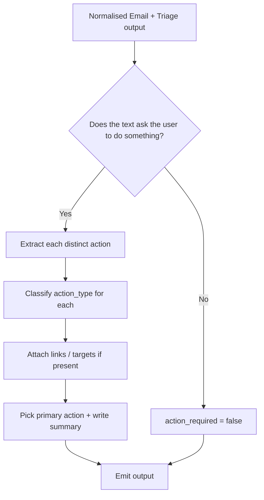

# 🤖 Action Agent

**Type:** AI extraction agent
**Related:** [[AMAR Orchestrator]] · [[Action Schema]] · [[Deadline Agent]] · [[Agent Output Schema]]

---

## Role

Answers one question:

> **"What does the user need to do?"**

Runs only when the [[Triage Agent]] set `further_analysis_required = true` (decided by the [[AMAR Orchestrator]]).

---

## Responsibilities

- Detect whether **action is required** by the user
- Extract **one or more** discrete actions
- Identify the **action type** for each

### Action types

| Type | Example trigger |
|---|---|
| `FORM_SUBMISSION` | "Fill this Google Form" |
| `REPLY` | "Please confirm your availability" |
| `REGISTRATION` | "Register for the workshop" |
| `DOCUMENT_UPLOAD` | "Upload your resume / marksheet" |
| `PAYMENT` | "Pay the registration fee" |
| `ATTEND_EVENT` | "Session on Friday 3 PM" |
| `COMPLETE_ASSIGNMENT` | "Submit assignment 3" |
| `READ_AND_ACKNOWLEDGE` | "Please read the circular carefully" |
| `OTHER` | Anything not covered |

---

## Output

Envelope per [[Agent Output Schema]]. The `data` payload follows [[Action Schema]]:

```json
{
  "action_required": true,
  "actions": [
    {
      "action_type": "FORM_SUBMISSION",
      "action_description": "Fill and submit the summer internship application form.",
      "target_link": "https://forms.college.edu/internship-2026",
      "related_email": "gmail_18f0a1b2c3",
      "blocking": true,
      "confidence": 0.94
    },
    {
      "action_type": "DOCUMENT_UPLOAD",
      "action_description": "Attach an updated resume in PDF format to the form.",
      "target_link": null,
      "related_email": "gmail_18f0a1b2c3",
      "blocking": true,
      "confidence": 0.81
    }
  ],
  "action_type": "FORM_SUBMISSION",
  "action_description": "Submit the internship application form with an updated resume.",
  "related_email": "gmail_18f0a1b2c3",
  "confidence": 0.9
}
```

| Field | Description |
|---|---|
| `action_required` | Boolean |
| `actions[]` | List of discrete actions (see [[Action Schema]]) |
| `action_type` | The **primary** action type (summary) |
| `action_description` | One-line summary of what the user must do |
| `related_email` | `email_id` from [[Email Schema]] |
| `confidence` | Overall 0.0–1.0 |

---

## Decision flow



---

## Rules

- Split compound instructions into **separate** action items ("register **and** upload resume" → two actions).
- Mark an action `blocking = true` if it must be done before a deadline or before another action.
- Do **not** extract or normalise dates here — that is the [[Deadline Agent]]'s job. You may quote raw deadline text inside `action_description` / `raw_deadline_hint` for context.
- If no action is requested, return `action_required = false` with an empty `actions` array.
- Always return valid JSON matching [[Agent Output Schema]] + [[Action Schema]].

---

## Backend implementation notes (Phase 5)

`backend/app/agents/action_agent.py` (+ `action_rules.py`). **Hybrid**, mirroring
the [[Triage Agent]]:

1. **Layer 1 — deterministic**: explicit action-phrase matching on the
   **cleaned** body + subject, split into clauses. Per-clause **negation**
   (`"do not reply"`), **completion** (`"has already been submitted"`) and
   **conditional** (`"reply only if…"`) context is detected and suppresses or
   downgrades the matched action. Repeated language for one type collapses to a
   single action with the strongest evidence.
2. **Layer 2 — LLM** (reuses `llm_service.py`): only when Layer 1 confidence
   `< ACTION_LLM_THRESHOLD`, signals conflict, or all actions are merely
   implied — *and* a provider is configured. Constrained to the 9
   [[Action Schema]] types; validated; falls back to the deterministic result
   on any failure (`status = "partial"`).

The [[Triage Agent]] category is **supporting context only** — email content is
the primary evidence, and an explicit instruction always wins over category
(a `PROMOTIONAL` email that says "reply to confirm" still yields `REPLY`).

Confidence bands: explicit instruction ≈ 0.72–0.97, implied action ≈ 0.46–0.65,
conflicting halves the score. See [[Action Schema]] "Backend notes" for the
thresholds and the two additive fields (`evidence`, `detection_method`).
