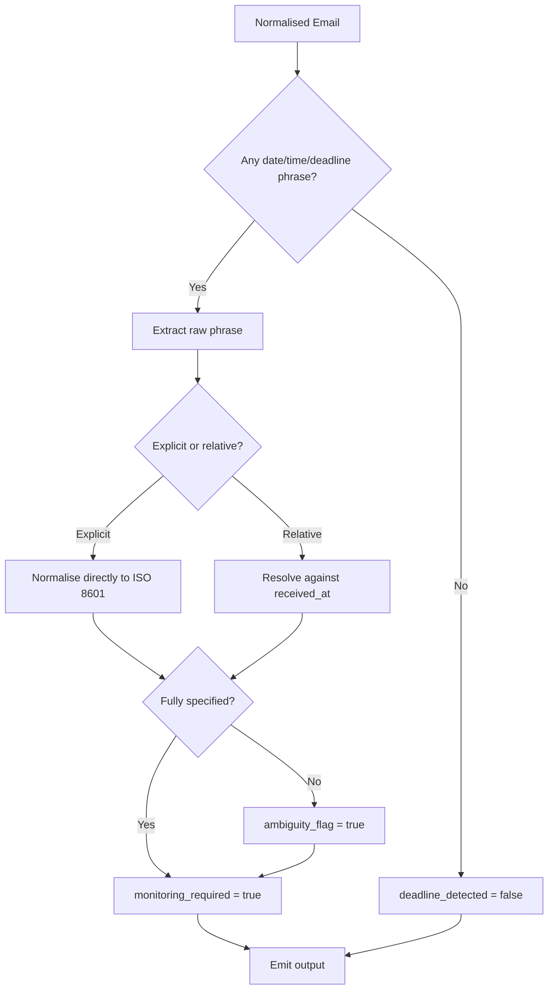

# 🤖 Deadline Agent

**Type:** AI extraction agent
**Related:** [[AMAR Orchestrator]] · [[Action Agent]] · [[Deadline Monitoring]] · [[Agent Output Schema]]

---

## Role

Answers one question:

> **"When does the user need to act?"**

Runs only when the [[AMAR Orchestrator]] decides deeper analysis is needed (usually alongside the [[Action Agent]]).

---

## Responsibilities

- Detect **explicit** deadlines ("by 2 September 2026, 6:30 PM")
- Detect **relative** time references ("within 48 hours", "by end of week", "tomorrow EOD")
- Extract dates and times
- **Normalise** into ISO 8601 (`YYYY-MM-DDTHH:MM:SS±HH:MM`)
- Flag **ambiguous** deadlines
- Decide whether **deadline monitoring** is required

---

## ⚠️ Division of responsibility

| Task | Who does it |
|---|---|
| Find the deadline phrase in the text | **Deadline Agent (LLM)** |
| Convert phrase → ISO 8601 timestamp | **Deadline Agent (LLM)**, using the email's `received_at` as the reference point |
| Compute "time remaining" / "is it overdue" | **Backend code (deterministic)** — never the LLM |
| Trigger reminders / escalation | **Backend code** — see [[Reminder Escalation]] |

The LLM must **not** do arithmetic on time. It only extracts and normalises.

---

## Output

Envelope per [[Agent Output Schema]]. The `data` payload:

```json
{
  "deadline_detected": true,
  "raw_deadline_text": "Fill the form by 2 September 2026, 6:30 PM",
  "normalized_deadline": "2026-09-02T18:30:00+05:30",
  "timezone": "Asia/Kolkata",
  "ambiguity_flag": false,
  "ambiguity_reason": null,
  "monitoring_required": true,
  "confidence": 0.93,
  "reference_time_used": "2026-08-28T09:14:22+05:30"
}
```

| Field | Description |
|---|---|
| `deadline_detected` | Boolean |
| `raw_deadline_text` | Exact phrase copied from the email |
| `normalized_deadline` | ISO 8601, or `null` if it cannot be resolved |
| `timezone` | IANA tz name; default from [[User Preferences]] (`Asia/Kolkata`) |
| `ambiguity_flag` | `true` when the deadline is unclear |
| `ambiguity_reason` | Why it is ambiguous (missing year, "next Friday", no time, etc.) |
| `monitoring_required` | `true` if the system should track this until handled |
| `confidence` | 0.0–1.0 |
| `reference_time_used` | The `received_at` value used to resolve relative dates |

---

## Ambiguity handling

| Situation | Action |
|---|---|
| Date with no time | Set time to end-of-day `23:59:59` in user tz, `ambiguity_flag = true`, reason `"no time specified"` |
| "next week" / "soon" / "ASAP" | `normalized_deadline = null`, `ambiguity_flag = true`, still `monitoring_required = true` |
| Multiple dates in email | Pick the one attached to the primary action; list others in `reasoning`; flag |
| Past date detected | Emit it, `ambiguity_flag = true`, reason `"resolved date is in the past"` — let orchestrator decide |
| Missing year | Assume the nearest future occurrence, flag |

---

## Decision flow



---

## Rules

- Always record `reference_time_used` so backend calculations are reproducible.
- Default timezone comes from [[User Preferences]].
- Return valid JSON matching [[Agent Output Schema]].

---

## Backend implementation notes (Phase 6)

`backend/app/agents/deadline_agent.py` + `backend/app/utils/deadline_parsing.py`
+ `backend/app/models/deadline.py`. Hybrid, like the other agents:

1. **Layer 1 — deterministic** (`deadline_parsing.py`): extract candidate
   temporal phrases → classify each as **DEADLINE / EVENT_DATE / IGNORE** →
   normalise against the email's `received_at`. Always runs.
2. **Layer 2 — LLM** (reuses `llm_service.py`): only when Layer 1 is
   under-confident, a numeric date is DD/MM-vs-MM/DD ambiguous, the email uses
   deadline language but nothing concrete could be extracted, or the linked
   deadlines conflict. Every LLM deadline must be backed by text that appears in
   the email (no invention). Falls back to the deterministic result on failure.

### Payload: singular contract + `deadlines[]` (multi-deadline)

The vault `data` fields above are **singular** (one deadline). Phase 6 needs
multiple deadlines, so the payload **keeps the singular fields — they now
describe the *primary* deadline** (the one linked to the primary [[Action Agent]]
action, i.e. the vault's "Multiple dates → pick the one attached to the primary
action" rule) — and **adds**:

| Added field | Meaning |
|---|---|
| `deadlines[]` | every detected deadline (`deadline_id`, `raw_deadline_text`, `normalized_deadline`, `timezone`, `date_only`, `ambiguity_flag`, `ambiguity_reason`, `is_past`, `confidence`, `action_context`, `related_action_id`, `source`, `evidence`) |
| `event_dates[]` | dates detected but classified as scheduled events, not cutoffs — kept for transparency (STEP 7 / STEP 13) |
| `is_past` (top level) | primary deadline is already before `reference_time_used` — replaces overloading `ambiguity_flag` for past dates |
| `detection_method` | `deterministic` \| `llm` \| `llm_fallback_deterministic` |

`raw_deadline_text` / `normalized_deadline` are `null` when `deadline_detected = false`.

The **Priority Agent** still consumes only `normalized_deadline` + `ambiguity_flag`
(now: of the primary deadline) and computes proximity buckets itself.

### Documented conventions (in `deadline_parsing.py`)

- Reference instant = `received_at`; all relatives are anchored to it.
- Date with no time → `23:59:59` + `ambiguity_reason = "no time specified"`.
- `EOD` / "end of day" → `23:59:59` (not flagged). `noon` → 12:00. `COB` → 17:00.
  "midnight" → `23:59:59` of the stated day.
- "next <weekday>" → the weekday a week after the coming one, **flagged ambiguous**.
  "this / by <weekday>" → the coming weekday.
- Ambiguous all-numeric date (`05/09/2026`) → resolved by `DEADLINE_DATE_LOCALE`
  (`DMY` default) **and flagged**; also `needs_human_review` when no LLM ran.
- "soon" / "asap" / "next week" → `normalized_deadline = null`, flagged,
  `monitoring_required` still true.
- `is_past` is a static past/future check at extraction time — **not** "time
  remaining" / proximity, which stay with [[Priority Rules]] and [[Deadline Monitoring]].

Thresholds (`backend/app/core/config.py`): `DEADLINE_REVIEW_THRESHOLD` = 0.55,
`DEADLINE_LLM_THRESHOLD` = 0.60, `DEADLINE_DATE_LOCALE` = `DMY`.
