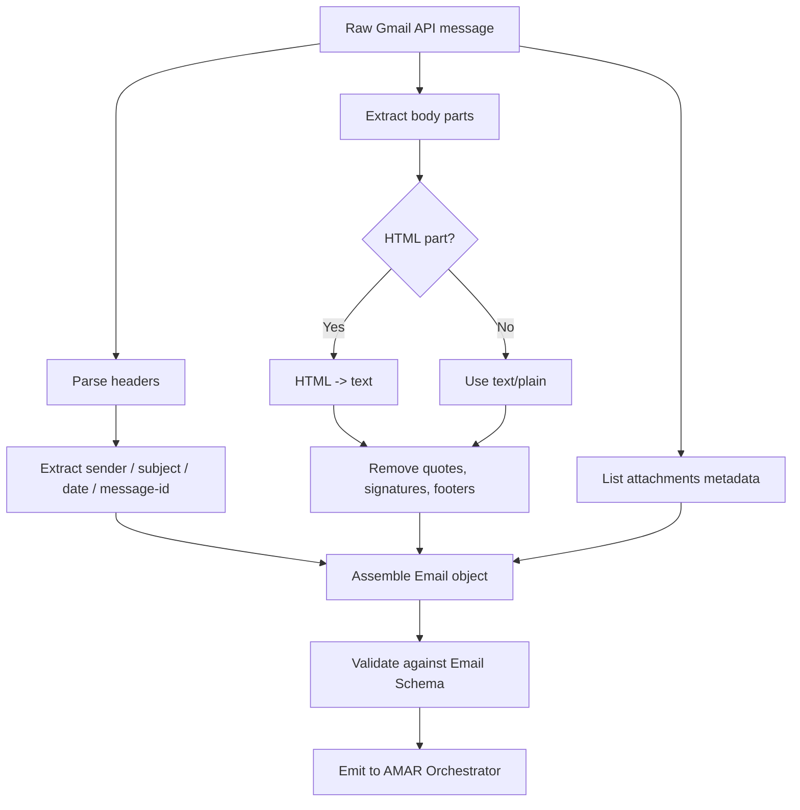

# 🤖 Mail Intake Agent

**Type:** Deterministic processing agent (minimal AI)
**Related:** [[AMAR Orchestrator]] · [[Email Schema]] · [[New Email Processing]]

---

## Role

The **entry point** for every email. It receives raw data from the Gmail API and produces a **clean, normalised, structured email object** that all other agents consume.

> This agent should be **deterministic wherever possible**. AI is only used for light cleanup (e.g. stripping quoted reply chains, detecting language) — never for classification or judgement.

---

## Responsibilities

- Receive email data from the **Gmail API**
- Extract:
  - `sender` (name + email address)
  - `subject`
  - `body` (plain text; HTML stripped to text)
  - `timestamp` (received time, ISO 8601)
  - `labels` (Gmail labels / folders)
  - `attachment metadata` (filename, mime type, size — **not** file contents)
- Clean and normalise:
  - Strip signatures, quoted history, tracking pixels, boilerplate footers
  - Collapse whitespace
  - Decode encodings (quoted-printable, base64)
  - Detect body language
- Output a structured email object following [[Email Schema]]

---

## Processing steps



---

## Deterministic vs AI

| Task | Method |
|---|---|
| Header parsing | Deterministic |
| Encoding / charset decode | Deterministic |
| HTML → text | Deterministic (library) |
| Attachment metadata | Deterministic |
| Timestamp normalisation to ISO 8601 | Deterministic |
| Quoted-reply / signature stripping | Deterministic rules first, AI fallback |
| Language detection | Library (deterministic) |

---

## Output example

```json
{
  "email_id": "gmail_18f0a1b2c3",
  "thread_id": "gmail_thread_9981",
  "sender": { "name": "Placement Cell", "email": "placement@college.edu" },
  "to": ["student@college.edu"],
  "subject": "Summer Internship 2026 - Application form (deadline Sep 2)",
  "body": "Dear students, applications for the summer internship program are now open. Fill the form by 2 September 2026, 6:30 PM. ...",
  "received_at": "2026-08-28T09:14:22+05:30",
  "labels": ["INBOX", "UNREAD", "CATEGORY_UPDATES"],
  "attachments": [
    { "filename": "internship_brochure.pdf", "mime_type": "application/pdf", "size_bytes": 482113 }
  ],
  "language": "en",
  "has_links": true
}
```

See the full field list in [[Email Schema]].

---

## Failure handling

- If the body cannot be decoded, keep the raw text and set `body_parse_error = true`.
- If required headers are missing, still emit the object and set `needs_human_review = true` so the [[AMAR Orchestrator]] can flag it.
- Never drop an email silently — log every intake to the [[Agent Activity Log]].
