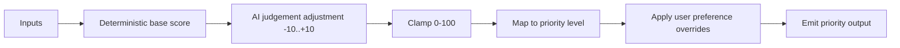

# 🤖 Priority Agent

**Type:** Hybrid agent (deterministic scoring + AI judgement)
**Related:** [[AMAR Orchestrator]] · [[Priority Rules]] · [[User Preferences]] · [[Important Senders]]

---

## Role

Answers one question:

> **"How important and urgent is this email?"**

Always runs. It is the last analysis step before the [[AMAR Orchestrator]] makes the final decision.

---

## Inputs

- Email category + subcategory — from [[Triage Agent]]
- `action_required` + action types — from [[Action Agent]]
- `normalized_deadline` + `ambiguity_flag` — from [[Deadline Agent]]
- **Deadline proximity** — computed by **backend code** (deterministic), passed in as a bucket:
  `OVERDUE` / `WITHIN_1H` / `WITHIN_24H` / `WITHIN_72H` / `LATER` / `NONE`
- Sender importance — from [[Important Senders]]
- User preferences — from [[User Preferences]]

---

## Output

Envelope per [[Agent Output Schema]]. The `data` payload:

```json
{
  "priority_score": 82,
  "priority_level": "URGENT",
  "score_breakdown": [
    { "factor": "action_required", "points": 30 },
    { "factor": "deadline_within_24h", "points": 25 },
    { "factor": "internship_or_placement", "points": 20 },
    { "factor": "important_sender", "points": 10 },
    { "factor": "ai_judgement_adjustment", "points": -3 }
  ],
  "notify": true,
  "monitor": true,
  "reasoning_summary": "Internship application with a form and a deadline in under 24 hours from an important sender.",
  "confidence": 0.9
}
```

### Priority levels

| Level | Score band (default) | Meaning |
|---|---|---|
| `CRITICAL` | 90–100 | Act now; escalating reminders |
| `URGENT` | 75–89 | Act today; notify immediately |
| `HIGH` | 55–74 | Handle soon; single notification |
| `MEDIUM` | 30–54 | Review when convenient |
| `LOW` | 0–29 | No notification; archive/label only |

Bands are **adjustable** — see [[Priority Rules]].

---

## Scoring model

**Step 1 — deterministic base score** (backend or agent applies the rule table):

| Factor | Points |
|---|---|
| Action required | +30 |
| Deadline within 1 hour (or overdue but still actionable) | +40 |
| Deadline within 24 hours | +25 |
| Deadline within 72 hours | +12 |
| Internship / placement / job opportunity | +20 |
| Assignment / exam / faculty announcement | +15 |
| Important sender (`HIGH`) | +10 |
| Important sender (`CRITICAL`) | +20 |
| Reply explicitly requested | +15 |
| Promotional email | −30 |
| Newsletter / social | −20 |
| Spam | −40 |

Clamp to `0–100`.

**Step 2 — AI judgement adjustment** (`−10` to `+10`):
The LLM may nudge the score for tone, implied urgency, or nuance the rules miss, and must explain the nudge in `reasoning_summary`.

**Step 3 — user preference overrides** from [[User Preferences]] are applied last and can force a level.



---

## Rules

- The deterministic table is the backbone; AI only fine-tunes.
- If [[Deadline Agent]] set `ambiguity_flag = true`, do **not** award full deadline-proximity points; add `+10` "possible deadline" instead and set `monitor = true`.
- `notify = true` whenever level ≥ `HIGH`, unless [[User Preferences]] says otherwise.
- `monitor = true` whenever `action_required = true` and the action is not yet done.
- Always return valid JSON matching [[Agent Output Schema]].

---

## Backend implementation notes (Phase 7)

`backend/app/agents/priority_agent.py` + `backend/app/utils/priority_scoring.py`
(deterministic engine) + `backend/app/services/priority_context.py` (memory
adapter). The [[Priority Rules]] factor table, buckets and level bands are the
source of truth.

### Flow

1. **Backend code** computes the deadline-proximity bucket from
   `normalized_deadline` vs the **current time** (`now`, not `received_at` —
   that was the [[Deadline Agent]]'s reference for *normalisation*). Timezone-aware
   only; naive inputs are made aware, never compared to aware.
2. **Deterministic score** — the [[Priority Rules]] §2 factor table → clamp 0–100.
3. **Bounded LLM adjustment** (`-cap..+cap`, default ±10) — **only** when
   deterministic signals conflict (urgency wording in a promo, important sender
   on a social notification, a gray-zone high-value email, low upstream
   confidence). Reuses `llm_service.py`. Never invents deadlines/actions, never
   overrides a user preference, never breaks the pipeline.
4. **Score → level**, then **overrides** in this precedence:
   important-sender `CRITICAL` floor `HIGH` → category-band floor/ceiling →
   explicit [[User Preferences]] §6 → `OVERDUE` ceiling `URGENT` → safety bias.

### Clarifications made in the backend

| Clarification | Where |
|---|---|
| Ambiguous deadline: `normalized_deadline == null` → `+10` flat; present-but-flagged → proximity points × `PRIORITY_AMBIGUOUS_DEADLINE_FACTOR` (0.7) | this doc's "Rules" said "not full" — now quantified |
| Category band floor/ceiling: HIGH-band categories → floor `MEDIUM`; LOW-band → ceiling `MEDIUM` | [[Priority Rules]] §6 said "e.g." |
| An **`OVERDUE`** deadline ceilings the level at `URGENT` (escalating reminders on a passed deadline are pointless); `deadline_is_past` carries the detail | new |
| **Safety bias** (never silently suppress): HIGH-value category + `action_required` + ambiguous/unresolved deadline + level < `HIGH` → bump to `HIGH` + `needs_human_review` | brief STEP 8 |
| LOW-band categories (`PROMOTIONAL`/`NEWSLETTER`/`SPAM`/`SOCIAL`) → never `notify`, never `monitor` | [[User Preferences]] §2 "never notify" |
| [[User Preferences]] §6.1 ("internship/placement → min `URGENT`") does **not** apply to LOW-band categories — a social/marketing email that merely contains the word is not an opportunity | §6.1 clarified |

### `data` payload — additive fields

Keeps the vault contract (`priority_score`, `priority_level`, `score_breakdown[]`,
`notify`, `monitor`, `reasoning_summary`, `confidence`) and adds:
`proximity_bucket`, `time_remaining_seconds`, `deadline_is_past`, `factors{}`,
`overrides_applied[]`, `scoring_method` (`deterministic` |
`deterministic+llm_adjustment` | `deterministic+llm_unavailable`),
`reference_time_used`.

### Memory adapter (STEP 11)

`PriorityContext` — an interface for sender importance ([[Important Senders]]),
user overrides ([[User Preferences]] §6), category bands (§2) and notify levels
(§3). `StaticPriorityContext` mirrors the markdown as constants today; a
DB-backed context can replace it without touching `priority_agent.py`.

Config (`backend/app/core/config.py`): `PRIORITY_AMBIGUOUS_DEADLINE_FACTOR` = 0.7,
`PRIORITY_LLM_MAX_ADJUSTMENT` = 10.
