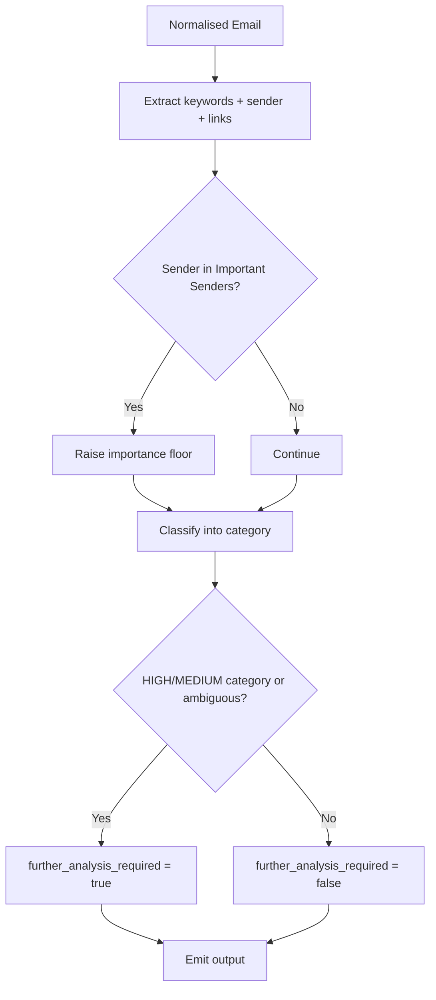

# 🤖 Triage Agent

**Type:** AI classification agent
**Related:** [[AMAR Orchestrator]] · [[Classification Rules]] · [[Email Schema]] · [[Agent Output Schema]]

---

## Role

Answers one question:

> **"What kind of email is this?"**

It classifies the normalised email (from [[Mail Intake Agent]]) into a category, estimates importance, and tells the [[AMAR Orchestrator]] whether deeper analysis by the [[Action Agent]] and [[Deadline Agent]] is needed.

---

## Categories

| Category | Meaning | Typical priority band |
|---|---|---|
| `INTERNSHIP` | Internship opportunity / application | HIGH |
| `PLACEMENT` | Campus placement drive / opportunity | HIGH |
| `JOB_OPPORTUNITY` | Job opening, off-campus role | HIGH |
| `ASSIGNMENT` | Assignment / submission / coursework | HIGH |
| `EXAM` | Exam schedule, hall ticket, results | HIGH |
| `FACULTY_ANNOUNCEMENT` | Official message from faculty / dept | HIGH |
| `REPLY_REQUIRED` | Someone is waiting on the user's reply | HIGH |
| `ACADEMIC_INFORMATION` | General academic info, no urgent action | MEDIUM |
| `PROJECT_UPDATE` | Project / team / group work updates | MEDIUM |
| `EVENT` | Event, workshop, club activity, registration | MEDIUM |
| `PROMOTIONAL` | Offers, discounts, marketing | LOW |
| `NEWSLETTER` | Subscriptions, digests | LOW |
| `SPAM` | Unsolicited / suspicious | LOW |
| `SOCIAL` | Social network notifications | LOW |
| `OTHER` | Does not fit above | MEDIUM (flag) |

Full rules, examples, and edge cases: [[Classification Rules]].

---

## Output

Follows the [[Agent Output Schema]] envelope. The `data` payload:

```json
{
  "category": "INTERNSHIP",
  "subcategory": "application_form",
  "importance_estimate": "HIGH",
  "further_analysis_required": true,
  "confidence": 0.96,
  "reasoning_summary": "Email from the placement cell announcing an internship program with an application form and an explicit submission deadline.",
  "signals": {
    "keywords": ["internship", "application form", "deadline"],
    "sender_in_important_list": true,
    "has_form_link": true
  }
}
```

| Field | Description |
|---|---|
| `category` | One value from the table above |
| `subcategory` | Free-text refinement (e.g. `hall_ticket`, `results`, `guest_lecture`) |
| `importance_estimate` | `HIGH` / `MEDIUM` / `LOW` — a first guess, not the final priority |
| `further_analysis_required` | If `true`, orchestrator runs [[Action Agent]] + [[Deadline Agent]] |
| `confidence` | 0.0–1.0 |
| `reasoning_summary` | One or two sentences, human-readable |
| `signals` | Structured evidence used for the decision |

---

## Decision flow



---

## Guidance for the LLM prompt

- Use [[Classification Rules]] as the source of truth for category definitions.
- Cross-check the sender against [[Important Senders]].
- Prefer `OTHER` + low confidence over guessing when genuinely unclear — the orchestrator will flag it.
- Never compute deadlines or actions here — only note whether *indicators* exist.
- Always return valid JSON matching [[Agent Output Schema]].

---

## Backend implementation notes (Phase 3)

The Triage Agent is **hybrid** — deterministic first, LLM only when needed:

1. **Layer 1 — deterministic** (`backend/app/agents/triage_agent.py` + `triage_rules.py`):
   keyword/sender/structure scoring, then the [[Classification Rules]] precedence
   rules applied deterministically. Always runs.
2. **Layer 2 — LLM** (`backend/app/services/llm_service.py`): consulted **only**
   when Layer 1 confidence `< TRIAGE_LLM_THRESHOLD` *and* an LLM provider is
   configured. The LLM chooses a category; the **hard** precedence rules
   (never `SPAM`/`PROMOTIONAL` for `@college.edu`; `SPAM` needs strong phishing)
   are still enforced on its answer. Provider-agnostic; the app runs fine with
   no LLM configured.

### Confidence thresholds (adjustable — live in `backend/app/core/config.py`)

| Setting | Default | Meaning |
|---|---|---|
| `TRIAGE_REVIEW_THRESHOLD` | 0.55 | final confidence below this ⇒ `needs_human_review = true` |
| `TRIAGE_LLM_THRESHOLD` | 0.70 | deterministic confidence below this ⇒ escalate to the LLM |
| `TRIAGE_UNKNOWN_OPPORTUNITY_CAP` | 0.70 | cap for an opportunity email from an unknown external sender (see [[Classification Rules]] edge cases) |

### `signals` payload (extends the example above)

The evidence bag also carries: `classification_method`
(`deterministic` \| `llm` \| `llm_fallback_deterministic`), `sender_importance`
(from [[Important Senders]]), `category_scores`, `precedence_applied`,
`conflicting_signals`.

> `confidence` and `reasoning_summary` are authoritative on the
> [[Agent Output Schema]] **envelope**; the `data` payload mirrors `confidence`
> for convenience.
