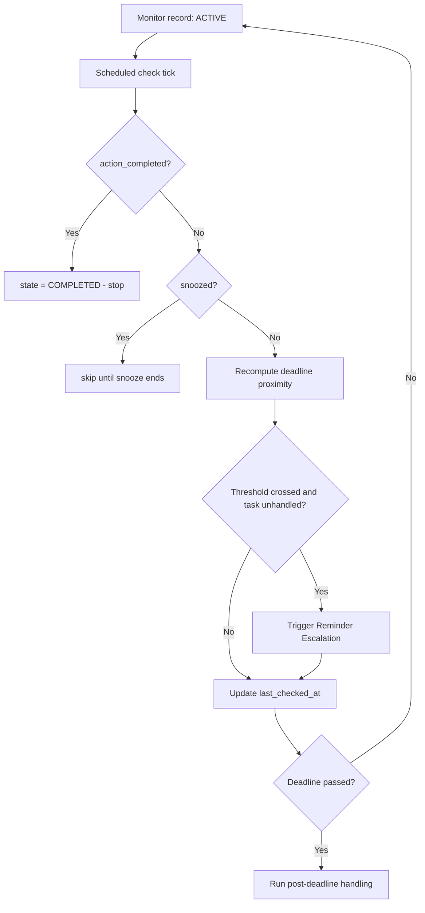

# 🔀 Workflow: Deadline Monitoring

**Related:** [[New Email Processing]] · [[Reminder Escalation]] · [[Deadline Agent]] · [[Priority Agent]] · [[AMAR Orchestrator]]

How AGENT AMAR keeps watching an important email until the user actually handles it.

> All state tracking and time math here is **deterministic backend code**. The LLM is not in this loop except to (optionally) re-summarise.

---

## When monitoring starts

Monitoring begins after [[New Email Processing]] when **all** of these hold:

1. `action_required = true` (from [[Action Agent]]), **or** `monitoring_required = true` (from [[Deadline Agent]]), **or** `priority_level >= HIGH`.
2. The action is **not already complete**.
3. [[User Preferences]] have not muted this category/sender.

> **Phase 10 status.** Implemented as `DeadlineMonitorService` (`backend/app/
> services/deadline_monitor_service.py`). It is a **deterministic, on-demand**
> pass — `run_deadline_check(now)` — invoked by tests or
> `POST /api/v1/monitor/deadlines/check`. There is **no background scheduler /
> timer yet** (that is Phase 11). "Check frequency" below describes the
> intended cadence once a scheduler exists; today each call evaluates every
> monitored deadline once.
>
> * Monitoring **auto-starts** for any `deadlines` row whose email has
>   `should_monitor = true`, that is still open and was never explicitly
>   stopped (concrete datetime **or** ambiguous both qualify).
> * Each pass reads viewed / completed / snoozed state + priority straight
>   from [[Persistent Email State]] — no re-classification.
> * Escalation events are written to the `notifications` table for the future
>   Flutter layer; nothing is delivered. See [[Reminder Escalation]].
> * `is_past`, `monitoring_stopped_at` are updated when a deadline passes /
>   grace elapses.

The backend creates a **monitoring record**:

```json
{
  "monitor_id": "mon_000123",
  "email_id": "gmail_18f0a1b2c3",
  "priority_level": "URGENT",
  "action_type": "FORM_SUBMISSION",
  "normalized_deadline": "2026-09-02T18:30:00+05:30",
  "ambiguity_flag": false,
  "state": "ACTIVE",
  "viewed_by_user": false,
  "action_completed": false,
  "created_at": "2026-08-28T09:15:03+05:30",
  "last_checked_at": "2026-08-28T09:15:03+05:30",
  "reminders_sent": []
}
```

---

## What the system tracks

| Signal | Source | Meaning |
|---|---|---|
| `viewed_by_user` | Gmail label change / read receipt / app open | User has at least seen the email |
| `action_completed` | User marks done in the AMAR app; or heuristic (reply sent, thread archived after deadline, label `AMAR/Done`) | The task is handled |
| `deadline_proximity` | Deterministic recompute each check | Drives [[Reminder Escalation]] |
| `snoozed_until` | User action | Pause reminders |

### Monitoring loop



Check frequency scales with urgency:

| Priority / proximity | Check interval |
|---|---|
| `CRITICAL` or `WITHIN_1H` | every 1–5 min |
| `URGENT` or `WITHIN_24H` | every 15–30 min |
| `HIGH` or `WITHIN_72H` | hourly |
| `MEDIUM` / `LATER` | every 6–12 h |

---

## How the system checks "viewed" vs "completed"

- **Viewed** = Gmail `UNREAD` label removed, or the user opened the email inside the AMAR app. Viewing **reduces** reminder aggressiveness by one step but does **not** stop monitoring.
- **Completed** = an explicit "Done" in the AMAR app, or a confident heuristic:
  - `REPLY` action + a reply message exists in the thread after the email
  - `FORM_SUBMISSION` / `REGISTRATION` + user tapped the tracked link and later marked done
  - User applied a `AMAR/Done` label
- Completion is the **only** thing that stops an active monitor before the deadline.

---

## When monitoring stops

| Reason | Final state |
|---|---|
| Action completed | `COMPLETED` |
| User dismisses / marks "not relevant" | `DISMISSED` |
| Deadline passed **and** post-deadline grace elapsed | `EXPIRED` |
| Email deleted | `CANCELLED` |

---

## What happens after a deadline passes

1. Recompute once more; if still unhandled, send **one final "deadline passed" notice** (not an escalating loop).
2. Enter a short **grace window** (default 24 h) in case the deadline was soft or the user still wants to act late.
3. Log the miss to [[Agent Activity Log]] and store an outcome record in the backend (useful for [[User Preferences]] learning — e.g. "user often ignores EVENT reminders").
4. After the grace window, set state `EXPIRED` and stop.

Escalation timing details: [[Reminder Escalation]].
