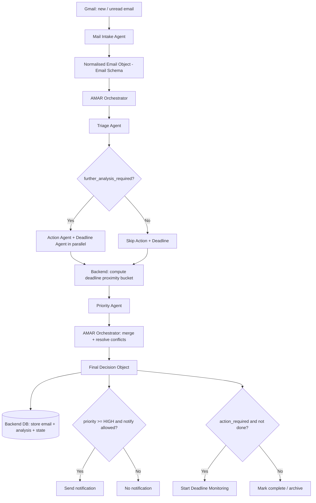

# 🔀 Workflow: New Email Processing

**Related:** [[Agent Control Center]] · [[AMAR Orchestrator]] · [[Deadline Monitoring]] · [[Reminder Escalation]]

The complete end-to-end flow for a single email, from arrival to notify / monitor.

---

## Overview diagram

---

## Step-by-step

### 1. Email received
Gmail API push (or poll) delivers a new or newly-unread message. Backend enqueues an `email.received` event with the raw payload.

### 2. Intake
[[Mail Intake Agent]] parses the raw message → **normalised email object** ([[Email Schema]]).
Deterministic where possible. Logs an intake event to [[Agent Activity Log]].

### 3. Orchestrator receives the event
[[AMAR Orchestrator]] validates the object and starts coordination.

### 4. Triage
[[Triage Agent]] classifies the email → category, subcategory, importance estimate, `further_analysis_required`, confidence, reasoning ([[Classification Rules]]).

### 5. Action & Deadline analysis (conditional)
If `further_analysis_required = true`, the orchestrator runs **in parallel**:
- [[Action Agent]] → `action_required`, `actions[]`, `action_type` ([[Action Schema]])
- [[Deadline Agent]] → `deadline_detected`, `normalized_deadline`, `ambiguity_flag` ([[Deadline Monitoring]])

### 6. Deadline proximity (deterministic)
**Backend code** compares `normalized_deadline` with the current time and produces a bucket:
`OVERDUE | WITHIN_1H | WITHIN_24H | WITHIN_72H | LATER | NONE`.
The LLM never does this arithmetic.

### 7. Priority scoring
[[Priority Agent]] combines category + action + deadline proximity + sender importance ([[Important Senders]]) + [[User Preferences]] → `priority_score`, `priority_level`, `notify`, `monitor` ([[Priority Rules]]).

### 8. Final decision
[[AMAR Orchestrator]] merges all outputs, resolves conflicts, and emits the **Final Decision Object** (see [[AMAR Orchestrator]]).

### 9. Store in database — **implemented (Phase 9)**
`PersistenceService` maps the Final Decision Object into [[Persistent Email State]]:
one `emails` row (idempotent on `email_id`), its `actions` + `deadlines`, and an
append-only `processing_runs` history entry. User state (viewed / completed /
snoozed) is preserved on every reprocess. Endpoint: `GET /api/v1/gmail/unread/process`
(persists) + `GET /api/v1/emails/...` (read + act on state). **Obsidian is not used for this.**

### 10. Notify (conditional) — **implemented (Phase 10, no delivery)**
When `routing.notify = true` and priority ≥ HIGH, a `new_priority_email`
`notifications` row is created with `reminder_level = NORMAL`, `status = PENDING`
(de-duplicated per email/type) — the initial "important email" alert.
Thereafter [[Deadline Monitoring]] adds escalating events. No alert is
*delivered* yet — the Flutter layer consumes the rows.

### 11. Monitor (conditional) — **implemented (Phase 10, on demand)**
`routing.monitor` is persisted on the email; `DeadlineMonitorService`
auto-starts `is_monitoring` on each qualifying `deadlines` row and, on every
`run_deadline_check(now)` pass, evaluates time-remaining + user state and emits
`NORMAL → REMINDER → URGENT → ALARM` events per [[Reminder Escalation]]. A
background scheduler is Phase 11.

---

## Data produced per email

| Artifact | Stored where |
|---|---|
| Normalised email | Backend DB |
| Triage / Action / Deadline / Priority outputs | Backend DB |
| Final decision | Backend DB |
| Monitoring state | Backend DB |
| Human-readable event trace | [[Agent Activity Log]] (summary) + backend (full) |
| Rules / preferences used | Obsidian ([[Classification Rules]], [[Priority Rules]], [[User Preferences]]) |

---

## Failure / edge behaviour

- Any agent returns low confidence → orchestrator sets `needs_human_review = true`, still stores + optionally notifies.
- Intake parse error → email is stored raw, flagged, surfaced to the user.
- Deadline ambiguous → email is still monitored; reminder uses "possible deadline" language.
