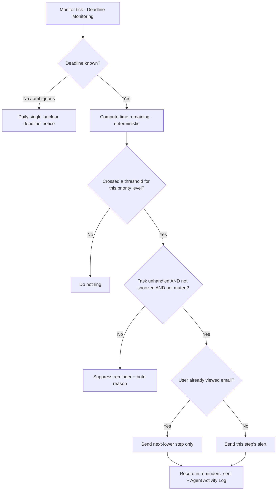

# 🔀 Workflow: Reminder Escalation

**Related:** [[Deadline Monitoring]] · [[Priority Rules]] · [[User Preferences]] · [[Priority Agent]]

Escalating alerts as a deadline approaches — **only while the task remains unhandled**.

> Deterministic backend logic. Time thresholds are computed by code, not the LLM.

---

## Core rule

> A reminder fires only if, at the moment the threshold is crossed:
> `action_completed = false` **AND** `snoozed = false` **AND** the category/sender is not muted in [[User Preferences]].
>
> If the user has **viewed** the email, drop the escalation by one step (e.g. skip the "initial" alert, keep the later ones).

---

## Escalation ladders by priority level

### CRITICAL

| Time remaining | Alert | Channel | Tone |
|---|---|---|---|
| 30 min | Initial alert | Push | "Heads up — X is due in 30 minutes." |
| 15 min | Reminder | Push + sound | "Reminder — X due in 15 minutes, not done yet." |
| 5 min | Final critical alert | Push + sound + repeat | "FINAL — X due in 5 minutes." |
| Deadline passed | One "deadline passed" notice | Push | "X deadline has passed." Then stop (see [[Deadline Monitoring]]). |

### URGENT

| Time remaining | Alert |
|---|---|
| 12 h | Initial alert |
| 3 h | Reminder |
| 1 h | Strong reminder |
| 15 min | Final alert |
| Passed | One "deadline passed" notice |

### HIGH

| Time remaining | Alert |
|---|---|
| 24 h | Initial alert |
| 6 h | Reminder |
| 1 h | Final alert |
| Passed | One "deadline passed" notice |

### MEDIUM

| Time remaining | Alert |
|---|---|
| 24 h | Single reminder |
| Passed | Silent log only |

### LOW

No escalation. Label/organise only.

All thresholds are **adjustable** and live in [[Priority Rules]].

---

## Ambiguous deadline (`ambiguity_flag = true` from [[Deadline Agent]])

- Cannot use time thresholds.
- Send **one** early notification: "This email looks time-sensitive but the deadline is unclear — please check."
- Keep monitoring; re-notify once per day at most until handled or dismissed.

---

## Flow

---

## De-duplication & quiet hours

- Never send the **same** threshold alert twice for one monitor record.
- Respect **quiet hours** from [[User Preferences]] — queue non-critical alerts until quiet hours end.
- `CRITICAL` "final" alerts **override** quiet hours (configurable).
- Rate-limit: at most 1 alert per monitor per 5 minutes, except the `CRITICAL` 5-minute final.

---

## Snooze

User can snooze a reminder: `+15m`, `+1h`, `+1d`, or "until tonight".
Snoozing sets `snoozed_until`; escalation resumes automatically after it, recomputing which thresholds were missed and firing only the **most recent** relevant one.

---

## Logging

Every fired, demoted, or suppressed reminder writes an entry to [[Agent Activity Log]] and a full record to the backend, so [[User Preferences]] can later learn from ignored reminders.

---

## Backend implementation notes (Phase 10)

`backend/app/services/escalation_policy.py` is the single machine copy of the
ladders above; `deadline_monitor_service.py` applies them.

**Four levels.** The vault's "initial / reminder / strong reminder / final"
steps collapse to a 4-rung enum used on `notifications.reminder_level` /
`.severity`:

| Rung | Meaning | `requires_alarm` |
|---|---|---|
| `NORMAL` | the "important email" alert, created once at processing time (Phase 9) | no |
| `REMINDER` | first time-based nudge | no |
| `URGENT` | strong / near-deadline nudge | no |
| `ALARM` | the defining behaviour — only `CRITICAL` (≤5 min) and `URGENT` (≤15 min) ladders reach it | **yes** |

**Ladders actually shipped** (time remaining ⇒ rung), mirroring the tables above:

| Priority | Rungs |
|---|---|
| `CRITICAL` | 30 m → `REMINDER`, 15 m → `URGENT`, 5 m → `ALARM` |
| `URGENT` | 12 h → `REMINDER`, 3 h / 1 h → `URGENT`, 15 m → `ALARM` |
| `HIGH` | 24 h / 6 h → `REMINDER`, 1 h → `URGENT` (never `ALARM`) |
| `MEDIUM` | 24 h → `REMINDER` (in-app only) |
| `LOW` | none |

**Alarm eligibility** — an `ALARM` rung is downgraded to `URGENT` unless *all*
hold: priority ≥ `HIGH`, not completed, not snoozed, monitoring active, and the
email is **unviewed OR its required action is still pending**.

**Viewed demotion.** If `is_viewed` is true the computed rung drops one step
(`REMINDER` → nothing, `URGENT` → `REMINDER`, `ALARM` → `URGENT`).

**De-duplication / escalation state (STEP 13/14).** No stored "current level"
field — it is **derived**: `notifications.highest_escalation_for(deadline)`
returns the most-urgent `deadline_escalation` rung already issued (PENDING/SENT).
A pass issues a new event only when the target rung outranks that. Repeated
passes are therefore idempotent; each rung fires at most once per deadline.

**Quiet hours** — `NORMAL`/`REMINDER`/`URGENT` suppressed (a single `SKIPPED`
`notifications` row is recorded, not re-created each pass); `ALARM` breaks
through **only for a `CRITICAL` deadline** (`ALARM_BREAKS_QUIET_HOURS_FOR_CRITICAL`).

**After the deadline** — one `deadline_passed` event, `is_past = true`, then
monitoring stops once `DEADLINE_PASSED_GRACE_HOURS` (24 h) have elapsed. Nothing
is deleted.

**Ambiguous deadline** — one `ambiguous_deadline` event; the daily re-notify is
not yet implemented.

**Not implemented:** rate-limiting windows, `max notifications/hour`, learned
down-weighting, muted category/sender suppression, actual delivery.
